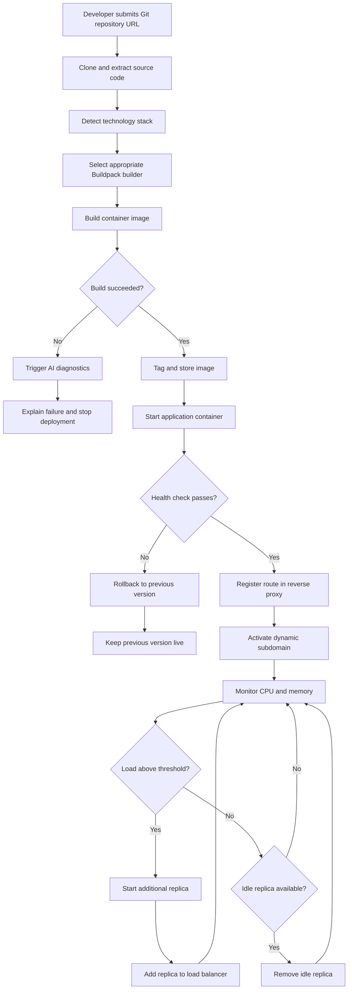

# NEXORA: "Push Code, Go Live"

## Project Abstract

Deploying web applications typically demands a significant amount of manual configuration that distracts developers from writing actual code. The traditional workflow involves provisioning virtual machines, writing Dockerfiles, configuring reverse proxies, and manually monitoring system resources to handle traffic spikes. While commercial Platform-as-a-Service (PaaS) solutions abstract this complexity, they can introduce vendor lock-in, recurring costs, and opaque internal processes that make debugging failed deployments difficult.

**NEXORA** is a self-hosted, AI-integrated deployment and container orchestration platform designed to simplify the application deployment lifecycle. Acting as an automated deployment pipeline, it enables developers to deploy applications by providing a Git repository URL.

NEXORA automates the application lifecycle through the following core mechanisms:

- **Zero-Configuration Deployment:** Automatically detects the project's technology stack and selects an appropriate Buildpack builder, reducing the need for manually written Dockerfiles.

- **Dynamic Routing & Service Discovery:** Automatically configures reverse-proxy routing and exposes deployments through dynamically generated subdomains.

- **Resilient Rollouts:** Uses health-gated blue-green deployments. A new version receives live traffic only after passing health checks. If the new version fails, the system keeps the previous version active and removes the failed deployment.

- **Reactive Auto-Scaling:** Continuously monitors container CPU and memory usage and creates additional replicas when predefined resource thresholds are exceeded.

- **Self-Healing:** Detects failed or unhealthy containers and recreates them using the last successful image.

- **AI-Assisted Diagnostics:** Uses LLM-powered log analysis to analyze deployment failures and provide plain-language explanations and suggested fixes.

By combining automated deployment, container orchestration, routing, monitoring, scaling, self-healing, and AI-assisted diagnostics, NEXORA aims to simplify application deployment while keeping the underlying deployment process transparent to developers.

---

## Deployment & Auto-Scaling Workflow

The flowchart below illustrates the end-to-end lifecycle of an application deployed on the NEXORA platform:



---

## Core Features

### 1. Automated Deployment

Users provide a Git repository URL and NEXORA handles the deployment pipeline automatically.

```text
Git Repository
      ↓
Source Detection
      ↓
Buildpack Selection
      ↓
Container Image
      ↓
Container Deployment
```

### 2. Technology Stack Detection

NEXORA detects the application's technology stack from repository files and selects the appropriate build process.

Currently planned seed stacks include:

- Spring Boot / Java
- Express / Node.js
- Django / Python

### 3. Container Runtime Management

NEXORA manages application containers through Docker, including:

- Container creation
- Container startup
- Container inspection
- Container health
- Container termination
- Container recreation

### 4. Dynamic Routing

Traefik is used as the reverse proxy and routing layer.

Each project receives a dynamically generated subdomain:

```text
project-name.nexora.local
```

The routing layer automatically directs incoming requests to the appropriate application container.

### 5. Health-Gated Deployment

A newly deployed container must pass its health check before receiving traffic.

```text
Start New Container
        ↓
   Health Check
     /       \
   Pass      Fail
    ↓          ↓
Route       Deployment
Traffic     Failed
    ↓
Stop Old
Container
```

### 6. Blue-Green Deployment

During redeployment, the existing version remains active while the new version is started and tested.

```text
              ┌── New Version
              │
Traffic ──────┤
              │
              └── Old Version
                    ↓
              New Version Healthy?
                    ↓
              Switch Traffic
                    ↓
              Remove Old Version
```

If the new version fails its health check, the old version remains active.

### 7. Auto-Scaling

NEXORA periodically collects container resource metrics.

The initial scaling mechanism uses:

- CPU utilization
- Memory utilization
- Configurable threshold
- Consecutive readings to avoid reacting to temporary spikes

When the threshold is exceeded:

```text
High Resource Usage
        ↓
Start Replica
        ↓
Add Replica to Routing Pool
```

When additional capacity is no longer required, the extra replica can be removed.

### 8. Self-Healing

NEXORA detects containers that:

- Crash
- Disappear
- Remain unhealthy beyond the allowed grace period

The system can recreate the container from the last successful image.

```text
Container Failure
       ↓
Failure Detected
       ↓
Recreate Container
       ↓
Health Check
       ↓
Return to Service
```

### 9. AI-Assisted Diagnostics

When a build or deployment fails, NEXORA extracts the relevant failure information from the logs and sends it to an LLM-based diagnostic service.

The diagnostic result contains:

```json
{
  "likely_cause": "...",
  "explanation": "...",
  "suggested_fix": "..."
}
```

The goal is to make deployment failures easier to understand without requiring developers to manually interpret large stack traces.

---

## System Workflow

```text
                    ┌─────────────────────┐
                    │      Developer      │
                    └──────────┬──────────┘
                               │
                               │ Git Repository URL
                               ▼
                    ┌─────────────────────┐
                    │       Intake        │
                    │ Source Detection    │
                    └──────────┬──────────┘
                               │
                               ▼
                    ┌─────────────────────┐
                    │       Build         │
                    │    Buildpacks       │
                    └──────────┬──────────┘
                               │
                         Image Ready
                               │
                               ▼
                    ┌─────────────────────┐
                    │      Runtime        │
                    │ Docker Containers   │
                    └──────────┬──────────┘
                               │
                               ▼
                    ┌─────────────────────┐
                    │    Health Check     │
                    └───────┬─────┬───────┘
                            │     │
                         Fail     Pass
                            │     │
                            ▼     ▼
                       Rollback  Traefik
                                  │
                                  ▼
                           Live Subdomain
                                  │
                                  ▼
                         Metrics Monitoring
                                  │
                    ┌─────────────┴─────────────┐
                    │                           │
               High Load                   Normal Load
                    │                           │
                    ▼                           ▼
              Add Replica                 Keep Replica
                    │
                    ▼
              Load Balancer
                    │
                    └───────────────► Monitoring
```

---

## Technology Stack

### Backend

- Java
- Spring Boot
- Spring Security
- Spring Data JPA
- PostgreSQL

### Frontend

- React
- React Router
- Recharts

### Containerization & Runtime

- Docker
- docker-java
- Cloud Native Buildpacks
- Pack CLI

### Routing

- Traefik

### Monitoring

- Docker Engine API
- CPU and memory metrics
- Scheduled monitoring

### AI Diagnostics

- LLM API
- Structured diagnostic responses

### Development & Infrastructure

- Docker Compose
- GitHub
- CI pipeline

---

## Project Architecture

```text
                         NEXORA
                           │
            ┌──────────────┴──────────────┐
            │                             │
        React Web                    Spring Boot
        Frontend                       Backend
            │                             │
            │                 ┌───────────┼───────────┐
            │                 │           │           │
            │              Intake       Build       Runtime
            │                 │           │           │
            │                 │       Buildpacks    Docker
            │                 │                       │
            │                 └───────────┬───────────┘
            │                             │
            │                          Traefik
            │                             │
            │                       Live Applications
            │
            └────────────── PostgreSQL ──────────────┘
```

---

## Development Roadmap

| Sprint | Main Focus |
|---|---|
| Sprint 1 | Repository, infrastructure, contracts, CI, and initial authentication/intake setup |
| Sprint 2 | Buildpacks image building and build log handling |
| Sprint 3 | Docker container lifecycle and first end-to-end deployment |
| Sprint 4 | Traefik integration and dynamic project subdomains |
| Sprint 5 | Health checks, blue-green deployment, and rollback |
| Sprint 6 | Express and Django support with Milestone 2 integration |
| Sprint 7 | CPU/memory monitoring and threshold-based auto-scaling |
| Sprint 8 | Self-healing and initial React dashboard |
| Sprint 9 | Live logs, monitoring graphs, and Milestone 3 |
| Sprint 10 | AI diagnostics for failed deployments |
| Sprint 11 | JWT authentication and container security hardening |
| Sprint 12 | Metrics retention, log correlation, security review, and Milestone 4 |
| Sprint 13 | Bug fixing, documentation freeze, defense rehearsal, and final demo |

---

## Contributors

- **Contributor Name** — [@TalhahTahir](https://github.com/TalhahTahir)
- **Contributor Name** — [@/DuaShaikh11](https://github.com/DuaShaikh11)
- **Contributor Name** — [@rida-maheen](https://github.com/rida-maheen)

---

## License

This project is developed as a Final Year Project (FYP).
