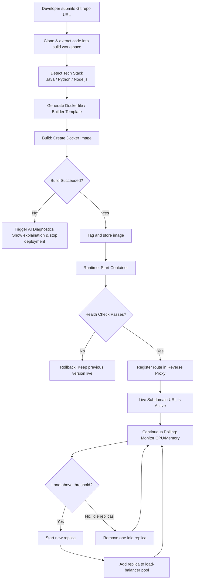

# NEXORA: "Push Code, Go Live"

## Project Abstract

Deploying web applications typically demands a significant amount of manual configuration that distracts developers from writing actual code. The traditional workflow involves provisioning virtual machines, writing Dockerfiles, configuring reverse proxies, and manually monitoring system resources to handle traffic spikes. While commercial Platform-as-a-Service (PaaS) solutions abstract this complexity, they often introduce vendor lock-in, recurring costs, and opaque internal processes that make debugging failed deployments difficult.

**NEXORA** is a self-hosted, AI-integrated deployment and container orchestration platform designed to bridge this gap. Acting as an automated DevOps pipeline, it empowers developers to deploy full-stack applications simply by providing a Git repository URL. 

NEXORA completely automates the application lifecycle through the following core mechanisms:
* **Zero-Configuration Deployment:** Automatically detects the project's technology stack (Node.js, Python, Java) and containerizes it using buildpack patterns, eliminating the need for manual Dockerfiles.
* **Dynamic Routing & Service Discovery:** Automatically configures reverse proxies to expose deployments on live, dynamic subdomains the moment they are ready.
* **Resilient Rollouts:** Employs health-gated, blue-green deployments. New updates only receive live traffic after passing health checks; if they fail, the system automatically rolls back to the previous stable version with zero downtime.
* **Reactive Auto-Scaling:** Continuously monitors container CPU and memory usage, automatically scaling replicas up during traffic spikes and down during quiet periods.
* **AI-Assisted Diagnostics:** Integrates LLM-powered log analysis to read raw build and runtime failure logs, translating complex stack traces into plain-language explanations and actionable fixes.

By combining an internal orchestration engine with intelligent system monitoring, NEXORA provides a transparent, cost-effective alternative to commercial PaaS platforms—simplifying infrastructure so developers can push code and go live instantly.

---

## Deployment & Auto-Scaling Workflow

The flowchart below illustrates the end-to-end lifecycle of an application deployed on the NEXORA platform:

